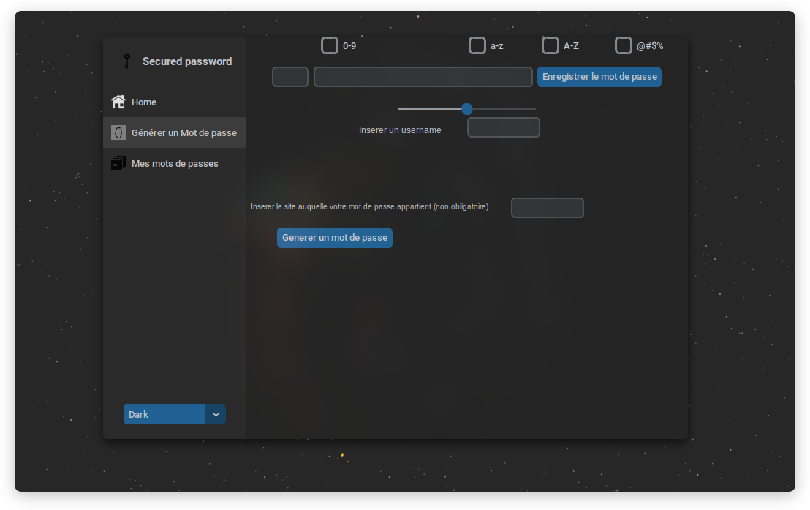
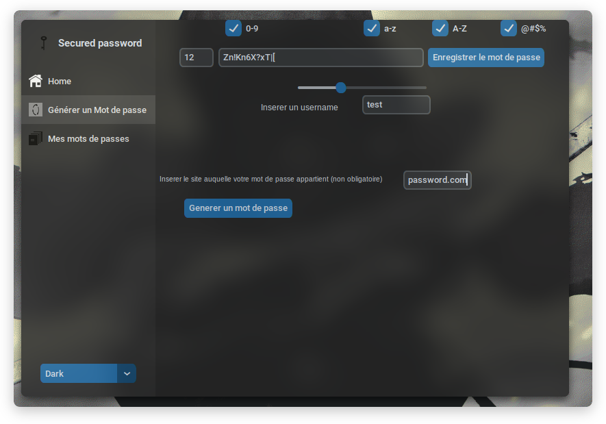
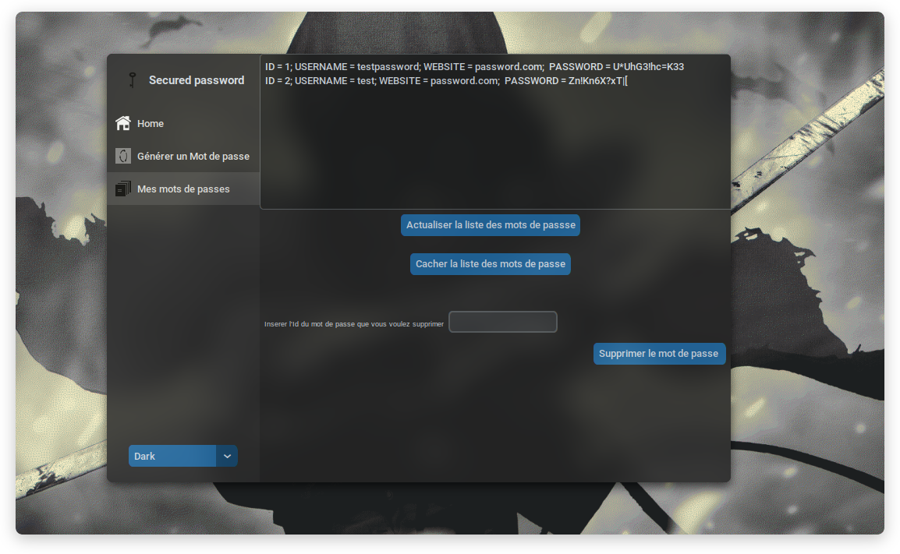
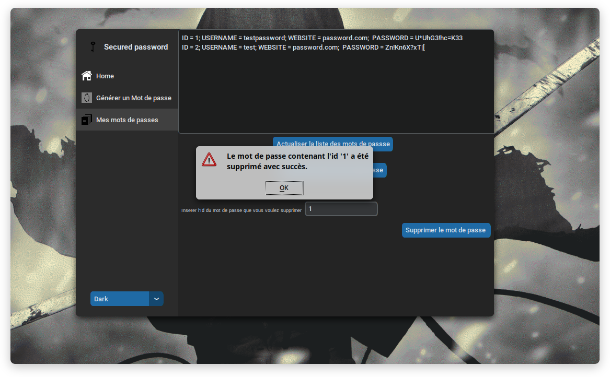

# Secured password

The project is a password manager designed to provide secure and convenient password management for individuals and organizations. It allows users to generate strong and unique passwords using a variety of characters, including uppercase and lowercase letters, numbers, and special characters. The password manager includes a database feature that securely stores and organizes passwords for different accounts and websites.

Cette application est un gestionnaire de mot de passe qui stocke localement vos informations de connexion en utilisant une base de données SQLite. L'interface graphique est créée à l'aide de la librairie Python Tkinter et d'un design personnalisé.
L'application vous permet de stocker en toute sécurité vos identifiants de connexion avec la possibilité de générer des mots de passe forts, allant de 8 à 30 caractères, incluant des minuscules, des majuscules, des chiffres et des caractères spéciaux. Vous pouvez également supprimer des mots de passe de la base de données en toute simplicité.
L'interface graphique intuitive vous permet de naviguer facilement entre les différentes fonctionnalités, notamment la visualisation des mots de passe enregistrés, la génération de nouveaux mots de passe, la suppression de mots de passe et la modification des informations stockées

## Features / Fonctionnalités

- Light/dark mode toggle
- Data base
- Cross platform
- Delete/Add/Generate passwords

## Screenshots

[App Screenshot]

## 🛠 Skills
Python

## Badges

